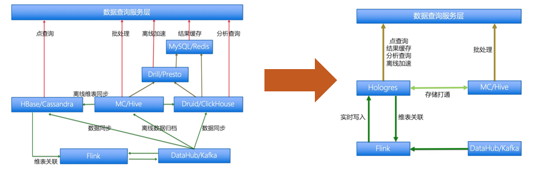

执行引擎

Hologres执行引擎是通用的分布式查询引擎，侧重于优化高并发低延迟的实时查询。通用是指可以表达和高效地执行所有类SQL查询。其它的分布式查询引擎，有的专注优化实时表的常用单表查询，但是对复杂查询表现不佳；有的支持复杂查询，但是实时场景性能要差一截。Hologres的理念是不做妥协，对这些场景都要瞄准极致性能。Hologres执行引擎能够做到对各种查询类型的高性能处理，主要是基于以下特点：

端到端的全异步处理框架，可以避免高并发系统的瓶颈，充分利用资源，并且最大可能地避免存储计算分离系统带来的读数据延迟的影响。

查询用异步算子组成的执行图DAG表示，可以方便对接查询优化器，利用业界各种查询优化技术。

算子内部处理数据时最大可能地使用向量化执行。

和存储引擎的深度集成，灵活的执行模型，能够充分利用各种索引，并且最大化地延迟向量物化和延迟计算，避免不必要的读数据和计算。

对常见实时数据应用查询模式的自适应增量处理。

对一些查询模式的独特优化。